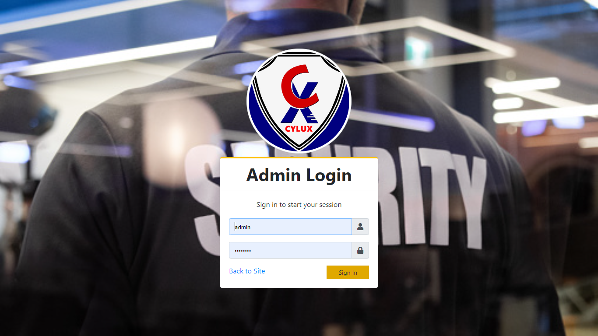

# Cylux
Cylux Security and Transport Agency is a company that was formed in late 2020. Its premises are in Nairobi, situated along Nyangumi road. The company basically deals with transportation and security services. Ideally the company is contracted by a client to offer various services depending on the client’s preference. The company works with two departments. The transport department and the Security department. If the client is looking for Security services be it security guards, security equipment, k9 units and any other security related business. The company drafts a contract with the various terms and conditions to be followed, the contact must be of mutual agreement to both parties.  
## Technologies used
* JavaScript
* CSS 
* MySql
* Php

# Screenshots
## Welcome Page screens
 

## Admin Login Screen

## Admin Dashboard Screen

## Pre-requisites
- Basic javascript,php,mysql ,Xampp, Visual Studio Code and Git knowledge, including an installed version of Git.

## Setup & Installation
* Clone the project into your machine from `https://github.com/johnkaizer/Cylux.git` or download the code, extract the files.
* Run the project in the forked root folder- gradle run.
* Install Xampp Server and start Mysql and Apache.
* copy the ectracted file in the xampp 'htdocs' folder.
* Open browser and search 'http://localhost/phpmyadmin/'.
* Create database 'cms_db' and import the 'cms_db.db' file from the project and the admin password are written in the file.
* open your bowsers and search 'http://localhost://your folder name/index.php'.

## Development
Want to contribute? Great!
To fix a bug or enhance an existing module, follow these steps:

- Fork the repo
- Create a new branch (`git checkout -b improve-feature`)
- Make the appropriate changes in the files
- Add changes to reflect the changes made
- Commit your changes (`git commit -am 'Improve feature'`)
- Push to the branch (`git push origin improve-feature`)
- Create a Pull Request
